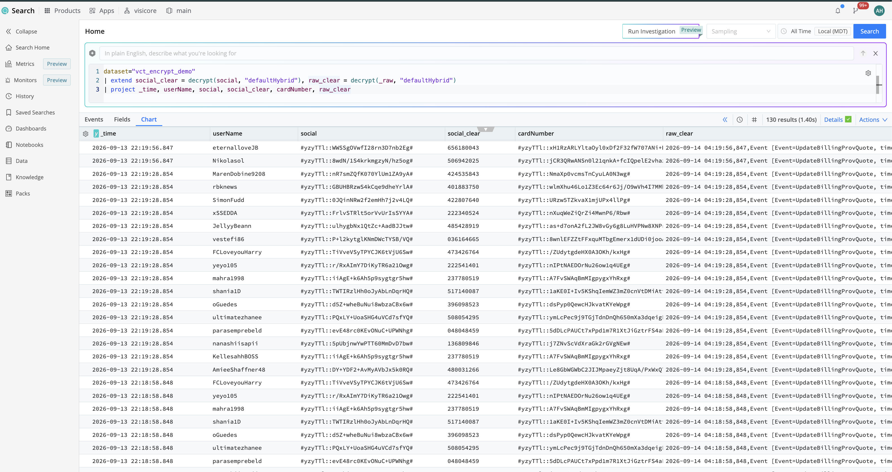

# Field Encryption for Cribl Search (cc-stream-field-encryption)

Field-level encryption in Cribl Stream, decrypted in Cribl Search. This pack replaces the Splunk `cribldecrypt` workflow (Cribl App for Splunk, key bundle on the search head, `cribl_keyclass_N` capabilities) with something that runs entirely inside Cribl: Stream encrypts selected values with `C.Crypto.encrypt`, the events land in a Cribl Lake dataset, and Cribl Search decrypts them on demand with its built-in `decrypt()` function. No key files are copied anywhere.

| Splunk workflow | Native Cribl workflow (this pack) |
|---|---|
| Mask / Eval with `C.Crypto.encrypt(value, keyclass)` in a Stream pipeline | Same, shipped as pipeline `encrypt_pii` |
| Download the key bundle (`cribl.secret` + `keys.json`) and copy it to the search head | Nothing to copy. Search reads the Worker Group's keys directly |
| `index=... \| cribldecrypt` | `dataset="..." \| extend x = decrypt(x, "<workerGroup>")` |
| Splunk role capability `cribl_keyclass_N` | Access to the Worker Group that owns the key |

## About this Pack

The pack contains:

| Item | Name | Notes |
|---|---|---|
| Pipeline | `encrypt_pii` | The encryption logic (below) |
| Route | `encrypt_pii` | Sends every event entering the pack through the pipeline, output `__group` (hand off to the Worker Group routes) |
| Sample data | `business_event_pii.log` | 22 billing events with `social=`, `cardNumber=`, `accountNumber=`, `userName=` (a copy of Cribl's built-in `business_event` sample). Use it in the pipeline's Sample Data pane to preview the ciphers |
| Source | `vct_field_encryption_datagen` | Datagen replaying Cribl's built-in `business_event` sample (same 22 events) at 1 event/sec. **Ships disabled**. It deliberately references the built-in sample rather than the pack's copy: Workers cannot resolve pack-scoped sample files for a Datagen Source and fail with `Unable to find sample with id=...` |

The pipeline is written against the `business_event` format so it can be demonstrated out of the box, but the patterns are easy to swap for your own fields.

`encrypt_pii` does three things, in order:

1. **`regex_extract`** pulls `social`, `cardNumber`, `accountNumber`, and `userName` out of `_raw` into top-level fields (`social=(?<social>\d+)` and so on).
2. **`eval`** overwrites `social`, `cardNumber`, and `accountNumber` with `C.Crypto.encrypt(String(value), 1)`. The `1` is the **key class**; Stream picks a key from that class in the Worker Group's Encryption Keys. It also adds `pii_encrypted=true` and `pii_keyclass=1` as markers. `userName` is left in clear text on purpose so you can see mixed fields.
3. **`mask`** applies the same three patterns to `_raw`, so the raw event carries the ciphers too (`social=#yzyTTl::TWTIRzlHh0oJyAbLnDqrHQ#`).

A cipher looks like `#<keyId>::<base64>#`. The key id inside it is how Search finds the right key at decrypt time, so one dataset can hold values encrypted with several keys or classes.

## Prerequisites

- Cribl Stream 4.13 or later, distributed (Cribl.Cloud or hybrid) with Cribl Search in the same organization.
- At least one **Encryption Key with key class 1** in the Worker Group that will run the pack. If you use a different class, change the second argument of every `C.Crypto.encrypt(...)` call in the pipeline.
- A destination Cribl Search can query. A Cribl Lake dataset is the simplest choice.

## Deployment

### 1. Create the encryption key

In the Worker Group: **Group Settings > Security > Encryption Keys > Add Key**. Set **Key class** to `1`, leave the algorithm at `aes-256-cbc`, save, and commit. Keys are per Worker Group and are stored in `groups/<group>/local/cribl/auth/keys.json`.

Through the API the same call is:

```bash
curl -X POST "$CRIBL_URL/api/v1/m/<group>/system/keys" -H "Authorization: Bearer $TOKEN" -H 'Content-Type: application/json' \
  -d '{"description":"field-encryption key","algorithm":"aes-256-cbc","keyclass":1,"kms":"local","expires":0,"useIV":false}'
```

The response includes the plaintext key once. Do not store it; Cribl already has it.

### 2. Install the pack

**Processing > Packs > Add Pack > Import from file** and pick `dist/cc-stream-field-encryption_<version>.crbl`, or install from a URL. Then commit.

### 3. Get data through the pack

Because the pack ships a Source, Cribl will not let a Worker Group Route use `pack:cc-stream-field-encryption` as its processor (packs that contain Sources or Destinations cannot be route processors, to prevent cycles). Data therefore enters the pack from a Source **inside** the pack, and the pack's `encrypt_pii` route outputs to `__group`, which hands the encrypted events to the Worker Group route table with `__inputId` intact.

**Demo:** inside the pack open **Sources** and enable `vct_field_encryption_datagen`. Then add a Worker Group Route:

| Setting | Value |
|---|---|
| Route filter | `__inputId.includes("vct_field_encryption_datagen")` |
| Pipeline | `passthru` (the pack already encrypted the fields) |
| Destination | Cribl Lake dataset `vct_encrypt_demo` |

**Your own data:** either add your Source inside the pack (Sources tab) and route it in the Worker Group the same way, or delete the Datagen Source from the pack, after which `pack:cc-stream-field-encryption` becomes usable as a normal Route processor for any Worker Group Source.

Commit and deploy the Worker Group. The Lake destination flushes files every five minutes, so allow a few minutes before the first events are searchable.

### 4. Decrypt in Cribl Search

Search needs no configuration. `decrypt(value, workerGroup)` looks the key up in the named Worker Group by the key id embedded in the cipher. The user running the search must have access to that Worker Group.

```kusto
dataset="vct_encrypt_demo"
| extend social_clear = decrypt(social, "defaultHybrid"),
         cardNumber_clear = decrypt(cardNumber, "defaultHybrid"),
         raw_clear = decrypt(_raw, "defaultHybrid")
| project _time, userName, social, social_clear, cardNumber, cardNumber_clear, raw_clear
```

`decrypt()` also works on strings with ciphers embedded in longer text, such as `_raw`. If the named Worker Group does not hold the key (wrong group, or no access to it) the function returns the literal `#CryptoDecrypt!` instead of a value. Plain strings that contain no cipher are returned unchanged.

With the default `aes-256-cbc` key and **Use initialization vector** off, encryption is deterministic: the same plaintext always produces the same cipher. That lets you search for a known value without decrypting anything (`where social == encrypt("517140087", "defaultHybrid", "<keyId>")`), at the cost of revealing which events share a value. Turn on the IV option on the key if that matters.

You can prove the round trip before any data exists:

```kusto
print c = encrypt("517140087", "defaultHybrid", "<keyId>")
| extend d = decrypt(c, "defaultHybrid")
```

Decrypted results are stored as plaintext in the Search job history. Shorten the Search history TTL if that matters for your data.

## Adapting the pack to your data

- **Different fields:** edit the `regex_extract` regex list and the `mask` rules. Keep the capture group names in sync with the `eval` entries.
- **Already-parsed JSON events:** drop `regex_extract` and `mask` and keep only the `eval`, referencing the fields directly.
- **Several sensitivity tiers:** create keys in classes 1, 2, 3 and encrypt each field with the class it belongs to. In Splunk the tier controlled who could decrypt; in Search the control is Worker Group access, so put keys for different audiences in different Worker Groups if you need that separation.
- **Encrypt on Edge:** the same functions work on Edge Fleets; the key must exist in the Fleet's own Encryption Keys.

## Testing checklist

1. `print c = encrypt(...) | extend d = decrypt(c, "<group>")` returns the original value.
2. After deploy, `dataset="vct_encrypt_demo" | limit 5` shows `social`, `cardNumber`, and `accountNumber` as `#<keyId>::...#` and `pii_encrypted == true`.
3. `decrypt(social, "<group>")` returns nine digits; `decrypt(_raw, "<group>")` returns the original event text.
4. `decrypt(social, "<some other group>")` returns `#CryptoDecrypt!`, which is what a user without access to the key's Worker Group sees.

Verified 2026-09-13 on Cribl 4.17: 130 datagen events, all three fields and `_raw` decrypted for every event, wrong-group test returned `#CryptoDecrypt!`.

## Results

Cribl Search showing the stored ciphers (`social`, `cardNumber`) next to the values `decrypt()` returns at query time (`social_clear`, `raw_clear`):



## References

- Decryption of Data in Splunk (the workflow this replaces): https://docs.cribl.io/stream/securing-data-decryption/
- Encryption of Data in Motion and key classes: https://docs.cribl.io/stream/securing-data-encryption/
- Create and Manage Encryption Keys: https://docs.cribl.io/stream/securing-encryption-keys/
- `C.Crypto` expression reference: https://docs.cribl.io/stream/expressions-crypto/
- Cribl Search `decrypt()`: https://docs.cribl.io/search/decrypt/
- Cribl Search `encrypt()`: https://docs.cribl.io/search/encrypt/

## Authors

- Andrew Hendrix <Andrewh@visicoretech.com>
- VisiCore Tech <CriblPacks@VisiCoreTech.com>

## Release Notes

### Version 0.1.0 - 2026-09-13

- Initial release: `encrypt_pii` pipeline (regex extract, `C.Crypto.encrypt` key class 1, mask on `_raw`), default route, sample data `business_event_pii.log`, and a disabled Datagen Source `vct_field_encryption_datagen`.
